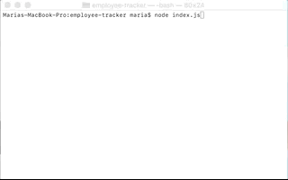

# employee-tracker

This is a solution for managing a company's employees using node, inquirer, and MySQL.

## Instructions

A command-line application allows the user to:

  * Add departments, roles, employees
  

  * View departments, roles, employees


  * Update employee roles

We can frame this challenge as follows:

```
As a business owner
I want to be able to view and manage the departments, roles, and employees in my company
So that I can organize and plan my business
```
